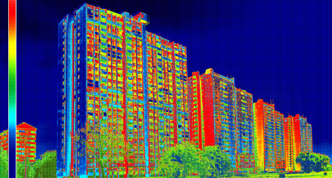

class: title, center, middle

# Bowtie

## Interactive Dashboards

### Jacques Kvam

### 2017-05-25

???

Hi Everyone! Thank you for coming!

My name is Jacques!

Bowtie is a library to let you create dashboard in python.

This will be a story of:

- how it came to be
- what you can do with it
- what i hope comes of it

---

class: center, middle

# Anonymous Chat

### https://bowtie-chat.herokuapp.com

???

Before getting started, I'd like to start with a fun teaser.

This is definitely not a goal of bowtie.
It's possible to have an anonymous chat app.
I thought I'd throw it up here so you all can chat with each other.
I hope I don't regret that decision.
Later in the presentation if there's time I can show you how this is built, it's about 50 lines.

---

# Who am I?

--

- Computer Engineer turned "Data Scientist".


???
basically once i started using this

--

- Work at energy analytics startup, Verdigris Technologies.


???
We try to help buildings run better.

--

- Heavy Python user for 3-5 years.

--

- I'm *not* a frontend developer.


???
I had to learn a lot and might be doing plenty wrong!

---

# Agenda

--

- Motivation

???
Why did I start the project

--

- A quick start

???
How can I get newcomers working with bowtie as quickly as possible

--

- Rapid prototyping tips

???
I want the bowtie's UX to be pretty painless, how can we remove as much drudgery as possible, and keep it fun

--

- Advanced features

--

- How to deploy

--

- Tech stack

--

- Future work and goals

--

- Will *not* be discussing similar tools.

???
for two reasons

- i haven't tried many other tools in depth (only so much time in the day)
- prefer to focus on the positive aspects of bowtie

---

# Motivation

???
What's my motivation for making this.
This is an open-source project
Why would I want to build this.

--

Want to click on a chart and generate another chart.

???
Sounds trivial but I had a use-case where it would be very convenient to explore
my company's dataset by clicking on data points to generate graphs about those points I clicked.

--

<!--  -->


---

# Tool Survey

--

- Don't want to use R!

???
Sorry I'm not a fan, never got into it.

--

- Looked for solutions in Python.

???
Mainly was looking at Pyxley and then Dash (the original).

I guess I was too dumb with Pyxley.

Dash was easier but I was still too dumb.

--

- Thought this should be easier.

--

- Thought it would be fun to write something.

---

background-image: url(standards.png)

???
Now you have another library to select from!

---

# Initial Thoughts

--

- Plotly charts have lots of events: selection, click, and hover.

--

- Just need to communicate between Python and JS in browser.

--

- Socket.io seems like it could do the trick.

--

- That's good enough for a proof of concept.

---

class: center, middle

# Fast forward a few months

---

# Your First Bowtie App

--

### Each app has three parts

--

- Choose the components in your app.

--

- Write the callbacks (in response to events).

--

- Layout the components and connect everything.

---

# First we need some prereqs

--

- Need Node to get us `yarn` and `webpack`.

```
$ brew install node
$ npm install -g webpack
$ brew install yarn
```

- Sorry for the MacOS bias.

--

- Install Bowtie.

```
$ pip install bowtie
```

- Works on Python 2 and 3

---

background-image: url(graduation.gif)

---

# Select the components

--

- These are the widgets that exist in your app.

--

- Full list of components on [readthedocs](https://bowtie-py.readthedocs.io/en/latest/components.html).

--

- Split into two categories: visual widgets and controller widgets.

--

- Visual: Plotly, SVG (matplotlib), Tables

--

- Controllers: DatePickers, Dropdown, Text, Sliders, Toggle, and a Button.

--

```
from bowtie.visual import Plotly
from bowtie.control import Dropdown

plot = Plotly()
ddown = Dropdown()
```

---

# What do these components do?

--

- Instructions for displaying itself in a webpage.

???
- Associated React component
- NPM package

--

- Commands, prefixed with `do_`, to update the state of the widget.

???
For example, updating a plot, updating text, updating dropdown options

--

- Events, prefixed with `on_`, to run python in response to.

???
For example, click events, selections

--

- Getters, prefixed with `get`, gets the current states of the widget.

--

- For example: [Dropdown docs](https://bowtie-py.readthedocs.io/en/latest/components.html#dropdown).

---

# Define the callbacks

--

- We'll define functions to get run when events happen.

--

```
import plotlywrapper as pw
def callback(item):
    chart = pw.line(range(item['value']))
    plot.do_all(chart.dict)
```

--

- We'll run this function in response to a dropdown event.

--

- The passed object for this dropdown is a dictionary with two keys: "label" and "value".

--

- To update the plot we call the `do_all` method.

---

# Layout the App

--

- We've chosen the components and defined the functionality.
Now we just need to connect events to functions and lay out the widgets.

--

```
from bowtie import command
@command
def build():
    from bowtie import Layout
    layout = Layout()
    layout.add(plot)
    layout.add_sidebar(ddown)
    layout.subscribe(callback, ddown.on_change)
    layout.build()
```

---

# Layout the App

```
from bowtie import command
```

The command decorator turns this function into a command line interface.
```
@command
def build():
    from bowtie import Layout
    layout = Layout()
    layout.add(plot)
    layout.add_sidebar(ddown)
    layout.subscribe(callback, ddown.on_change)
    layout.build()
```

???
I can show this off in a demo.


---

# Layout the App

```
from bowtie import command
@command
def build():
    from bowtie import Layout
    layout = Layout()
```
These `add*` calls place widgets into our app.
```
    layout.add(plot)
    layout.add_sidebar(ddown)
    layout.subscribe(callback, ddown.on_change)
    layout.build()
```

???
add adds it to the main view

add_sidebar adds it to a special control side pane

convenient for adding several controllers to it.

---

# Layout the App

```
from bowtie import command
@command
def build():
    from bowtie import Layout
    layout = Layout()
    layout.add(plot)
    layout.add_sidebar(ddown)
```
`subscribe` makes sure the callback gets run in response to the given event.
```
    layout.subscribe(callback, ddown.on_change)
    layout.build()
```

---

# Layout the App

```
from bowtie import command
@command
def build():
    from bowtie import Layout
    layout = Layout(debug=True)
    layout.add(plot)
    layout.add_sidebar(ddown)
    layout.subscribe(callback, ddown.on_change)
```
Finally, `build` compiles the app for us.
```
    layout.build()
```

---

# Build and Serve

--

- We're done writing the app, time to build and run it.

--

- The CLI we have gives us these commands:

```
Commands:
  build  Write the app, downloads the packages, and...
  dev    Recompile the app for development.
  prod   Recompile the app for production.
  serve  Serve the Bowtie app.
```

--

```
$ ./app.py build
```

???
Takes a minute.

--

```
$ ./app.py serve
```

---

background-image: url(coding.gif)

---

background-image: url(relief.gif)

---

class: title, center, middle

# Rapid prototyping

---

# Rapid prototyping

- Set `Layout(debug=True)`! Enables live code reloading on write.

--

- Minimize builds by architecting app at the beginning.

--

- Use debuggers or prints to learn the payload.

```
def select(points):
```
one of the following:
```
    print(points)
    import ipdb; ipdb.set_trace()
    import IPython; IPython.embed()
    import wdb; wdb.set_trace()
```

---

class: title, center, middle

# Advanced Features

---

# Listening to Plotly Events

--

- Plotly is a featureful Javascript charting library.

--

- It has several events and Bowtie exposes three event types: selection, click, and hover.

--

- The data it returns is not well documented, but it's not too hard to figure out.

---

# Subscribe to Multiple Events

--

- A common use-case is for a function to use the output from several widgets.

--

- Cumbersome to write individual callbacks for each event and get the other widgets' states.

```
def foo(a,b):
    pass
def cb1(a):
    b = b.get()
    foo(a,b)
def cb2(b):
    a = a.get()
    foo(a,b)
```
--

- A better way is to subscribe callbacks to multiple events.

--

```
def func(item1, item2, switch):
    cool_stuff()
...
layout.subscribe(func, ddown1.on_select, ddown2.on_select, switch.on_switch)
```

---

# Scheduling and Loading Events

--

- Bowtie also defines intrinsic event types.

--

- Instruct a function to run when a user loads the page.

```
layout.load(func)
```

--

- Instruct a function to run periodically.

```
layout.schedule(5, func) # call func every 5 seconds
```

---

# Storing data with the client

--

- In some cases it's helpful to be able to store data with the client.

???
- expensive computations
- user selected data

--

- Could store it server-side, but that's more setup.

--

- So we'll just send the data to the client and have them hold it.

--

- `bowtie.cache` gives a "key-value" store to save any python objects.

???
that are json serializable

--

- Helpful to store results from expensive computations or client specific data.

```
bowtie.cache.save(key, value)
value = bowtie.cache.load(key)
```

---

# Progress Indicators

--

- All visual widgets have an attached progress indicator.

--

- By default they are invisible so they don't get in your way.

--

- Really helpful for long computations or slow I/O.

--

- Can also indicate error states.

---

# Leverage CSS Grid

--

- New web standard to define grids on a page.

--

- Bowtie uses this and makes a "pythonic" API.

--

- CSS Grid was just released onto major browsers.

--

- Chrome >= 57, Firefox >= 52, Safari >= 10.1, Opera >= 44

---

# Leverage CSS Grid

- `Layout` class lets you specify how many rows and columns in the grid.

--

- call `.add` method and optionally specify which cells in the grid.

--

- Widgets can span 1 or multiple cells.

--

- Rows and columns can be sized on pixels, percentage, and fraction of available space.

---

# Authentication

--

- Flask makes it easy to support basic authentication.

--

- Want to have a generic authentication solution.

--

- I'm not a security expert so don't trust me.

---

background-image: url(demo.jpg)

---

class: center, middle

# Deploying

---

# Deploying

--

- Heroku is an easy option.

--

- Set `Layout(debug=False)`

--

- Compile with production.

```
$ python app.py prod
```

- Reduces JS bundle size by a factor of ~30 (from 30MB to 1MB).

--

- Commit the following files

```
build/src/server.py
build/src/templates/index.html
build/src/static/bundle.js.gz
```

---

class: center, middle

# Tech Stack

---

# Flask-SocketIO

--

- Bowtie is built on Flask and Flask-SocketIO.

--

- Bowtie abstracts away most of Flask.

???
This was because I wanted to make it fast and easy to build apps.

--

- You can still benefit from the Flask ecosystem.

???
For example, if you want to scale Bowtie you could use NGINX to do so.

--

- Kind of wish the user still touched Flask because it's a great API.

---

# React

--

- Nick Kridler (author of Pyxley) wrote about using React with Python.

--

- Frontend is written entirely in React.

--

- Making a new widget means making a new React class that communicates via socket.io.

---

# Talking through SocketIO

--

- All communication between Python and Javascript is through SocketIO

--

- Unique events are created by combining the component id with the type of message.

--

- For example: the event for updating Plotly is `"{id}#all"`

--

- Message payloads are encoded with msgpack to reduce payload size.

---

# Javascript Tools

--

- Yarn: for installing npm packages.

--

- Webpack: for bundling the npm packages.

--

- Leaky abstraction, but I don't want to turn bowtie into a node delivery device.

---

class: center, middle

# Future Work and Goals

---

# Some things I don't like

--

- You need to recompile your app to run it (when you make architectural changes) which takes a minute.

--

- Compared to some other tools, Bowtie is not as snappy.

--

- Perhaps too much magic happening behind the scenes, harder for users to change things and fix issues.

---

# User Experience Goals

--

- The power to create as much interactivity as you want.

???
If you decide to try bowtie and it can't do what you want.
I would like to hear from you!

--

- Painless rapid prototyping

--

- Be able to share with others

---

# Non Goals

--

- GUI for laying out widgets.

--

- Generic web app builder (my focus is on data science applications).

---

# Goals and Future Work

--

- Become Shiny!

--

- Okay, but seriously.

--

- Needs to be more robust, have better testing.

--

- Make it easier to scale and deploy.

--

- More charting libraries.

--

- More widgets.

--

- Make it look nicer?

--

- Jupyter integration (possible?)

---

class: center, middle

# My Real Goal

### Whether Bowtie becomes the Shiny of Python or not, I simply want to move the bar forward.

---

# Thanks

- To my Verdigris colleagues for feedback.

    - Danny Servén
    - Jared Kruzek
    - Martin Chang
    - Michael Roberts

- To Jeff for letting me present.

???
My Verdigris coworkers helped give feedback while it was still in it's early stages.

It was very helpful to see where "users" end up getting stuck.

Also gave me hope that they could work with it relatively easily.

---

# Thanks

- Github: `github.com/jwkvam/bowtie`

- Slides: `github.com/jwkvam/bowtie-talk`

- Docs: `bowtie-py.rtfd.io`
