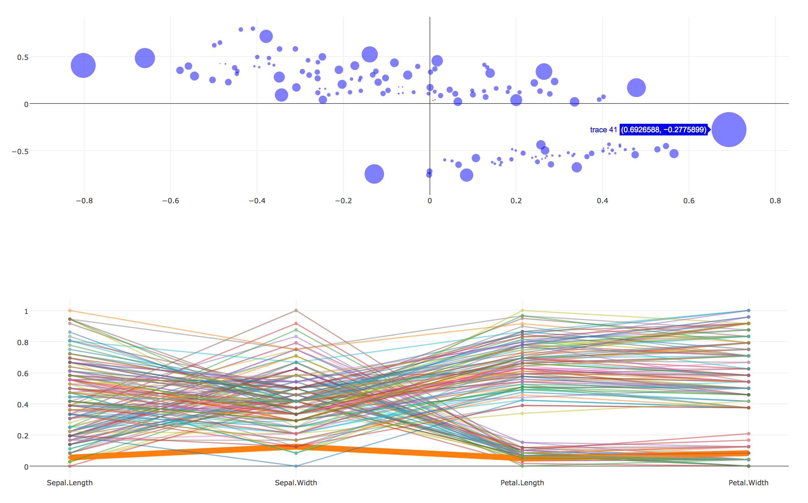

class: title, center, middle

# Bowtie

## Interactive Dashboards

### Jacques Kvam

### 2017-05-25

???

In a nutshell, Bowtie is a library to let you create dashboard in python.
This will be a story of how it came to be and what you can do with it.

---

class: center, middle

# Follow along

### https://github.com/jwkvam/bowtie-talk/slides.pdf

---

class: center, middle

# Anonymous Chat

### https://bowtiechat.herokuapp.com

???

This is definitely not a goal of bowtie.
It's possible to have an anonymous chat app.
I thought I'd throw it up here so you all can chat with each other.
I hope I don't regret that decision.
Later in the presentation if there's time I can show you how this is built, it's about 50 lines.

---

# Agenda

--

- Motivation

--

- A quick start

--

- Advanced features

--

- How to deploy
--

- Tech stack

--

- Future work and goals

---

# Motivation

???
What's my motivation for making this.
This is an open-source project
Why would I want to build this.

--

Want to click on a chart and generate another chart.

???
Hello

--

<!--  -->


---

# Tool Survey

--

- Don't want to use R!

--

- Looked for solutions in Python.

--

- Though this should be easier.

--

- Thought it would be fun to write something.

---

background-image: url(standards.png)

---

# Initial Thoughts

- Plotly charts have lots of events: selection, click, and hover.

--

- Just need to communicate between Python and JS in browser.

--

- Socket.io seems like it could do the trick.

--

- That's good enough for a proof of concept.

---

class: center, middle

# Fast forward a few months

---

# Your First Bowtie App

--

### Each app has three parts

--

- Choose the components in your app.

--

- Write the callbacks: these when events trigger.

--

- Layout the components and connect everything.

---

# First we need some prereqs

--

- Need Node to get us `yarn` and `webpack`.

```
$ brew install node
$ npm install -g webpack
$ brew install yarn
```

- Sorry for the MacOS bias.

--

- Install Bowtie.

```
$ pip install bowtie
```

---

background-image: url(graduation.gif)

---

# Select the components

--

- These are the widgets that exist in your app.

--

- Full list of components on [readthedocs](https://bowtie-py.readthedocs.io/en/latest/components.html).

--

- Split into two categories: visual widgets and controller widgets.

--

- Visual: Plotly, SVG (matplotlib), Tables

--

- Controllers: DatePickers, Dropdown, Text, Sliders, Toggle, and a Button.

--

```
from bowtie.visual import Plotly
from bowtie.control import Dropdown

plot = Plotly()
ddown = Dropdown()
```

---

# What do these components do?

--

- Instructions for displaying itself in a webpage.

--

- Commands, prefixed with `do_`, to update the state of the widget.

--

- Events, prefixed with `on_`, to run python in response to.

--

- Getters, prefixed with `get`, gets the current states of the widget.

--

- For example: [Dropdown docs](https://bowtie-py.readthedocs.io/en/latest/components.html#dropdown).

---

# Define the callbacks

--

- We'll define functions to get run when events happen.

--

```
import plotlywrapper as pw
def callback(item):
    chart = pw.line(range(item['value']))
    plot.do_all(chart.dict)
```

--

- We'll run this function in response to a dropdown event.

--

- The passed object for this dropdown is a dictionary with two keys: "label" and "value".

--

- To update the plot we call the `do_all` method.

---

# Layout the App

--

- We've chosen the components and defined the functionality.
Now we just need to connect events to functions and lay out the widgets.

--

```
from bowtie import Layout, command
@command
def build():
    layout = Layout()
    layout.add(plot)
    layout.add_sidebar(ddown)
    layout.subscribe(callback, ddown.on_select)
    layout.build()
```

---

# Layout the App

```
from bowtie import Layout, command
```

The command decorator turns this function into a command line interface.
```
@command
def build():
    layout = Layout()
    layout.add(plot)
    layout.add_sidebar(ddown)
    layout.subscribe(callback, ddown.on_select)
    layout.build()
```

---

# Layout the App

```
from bowtie import Layout, command
@command
def build():
    layout = Layout()
```
These `add*` calls place widgets into our app.
```
    layout.add(plot)
    layout.add_sidebar(ddown)
    layout.subscribe(callback, ddown.on_select)
    layout.build()
```

---

# Layout the App

```
from bowtie import Layout, command
@command
def build():
    layout = Layout()
    layout.add(plot)
    layout.add_sidebar(ddown)
```
`subscribe` makes sure the callback gets run in response to the given event.
```
    layout.subscribe(callback, ddown.on_select)
    layout.build()
```

---

# Layout the App

```
from bowtie import Layout, command
@command
def build():
    layout = Layout()
    layout.add(plot)
    layout.add_sidebar(ddown)
    layout.subscribe(callback, ddown.on_select)
```
Finally, `build` compiles the app for us.
```
    layout.build()
```

---

background-image: url(coding.gif)

---

background-image: url(relief.gif)

---

class: title, center, middle

# Advanced Features

---

# Listening to Plotly Events

--

- Plotly is a very featureful charting Javascript library.

--

- It has several events and Bowtie exposes three event types: selection, click, and hover.

---

# Subscribe to Multiple Events

--

- A common use-case is for a function to use the output from several widgets.

--

- It's annoying to have to write individually callbacks for each event and then get the other widget's states.

--

- A better way is to subscribe callbacks to multiple events.

--

```
def func(item1, item2, switch):
    # awesome stuff
...
layout.subscribe(func, ddown1.on_select, ddown2.on_select, switch.on_switch)
```

---

# Scheduling and Loading Events

--

- Bowtie also defines intrinsic event types.

--

- You can schedule a function to run when a user loads the page.

--

- You can schedule a function to run periodically.

---

# Storing data with the client

--

- In some cases it's helpful to be able to store data about the client.

--

- Could store it server-side, but that's more setup.

--

- So we'll just send the data to the client and have them hold it.

--

- `bowtie.cache` gives a "key-value" store to save any python objects.

--

- Helpful to store results from expensive computations or client specific data.

---

# Leverage CSS Grid

--

- New web standard to define grids on a page.

--

- Bowtie uses this and makes a "pythonic" API.

--

- CSS Grid was just released onto major browsers.

--

- Chrome >= 57, Firefox >= 52, Safari >= 10.1, Opera >= 44

---

# Leverage CSS Grid

- `Layout` class lets you specify how many rows and columns in the grid.

--

- call `.add` method and optionally specify which cells in the grid.

--

- Widgets can span 1 or multiple cells.

--

- Rows and columns can be sized on pixels, percentage, and fraction of available space.

---

# Authentication

--

- Flask makes it easy to support basic authentication.

--

- Want to have a generic authentication solution.

---

class: center, middle

# Deploying

---

# Deploying

---

class: center, middle

# Tech Stack

---

# Flask-SocketIO

--

- Bowtie is built on Flask and Flask-SocketIO.

--

- It abstracts away most of Flask.

--

- You can still benefit from the Flask ecosystem.

---

# React

--

- All widgets are React components.

---

# SocketIO

---


class: center, middle

# Future Work and Goals

---


---

# Thanks

- To my Verdigris colleagues for feedback.

    - Danny Servén
    - Jared Kruzek
    - Martin Chang
    - Michael Roberts

- To Jeff for letting me present.

???
My Verdigris coworkers helped give feedback while it was still in it's early stages.
It was very helpful to see where "users" end up getting stuck.

---

# Resources

- Github: `github.com/jwkvam/bowtie`

- Slides: `github.com/jwkvam/bowtie-talk`

- Docs: `bowtie-py.rtfd.io`
